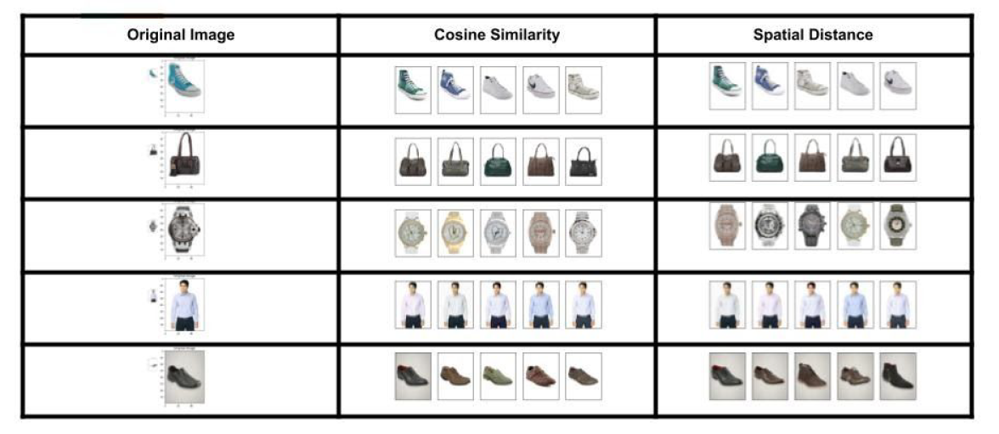

# Image-Based Product Recommendation System

[](https://www.python.org/)
[](https://www.tensorflow.org/)
[](https://keras.io/)
[](https://scikit-learn.org/)
[](https://opencv.org/)

An end-to-end unsupervised and deep-learning-based fashion recommendation system that extracts visual feature representations from product images, groups them using clustering techniques, and recommends visually similar matching items. 

---

## 📌 Project Overview
Finding visually similar products is a core challenge in modern e-commerce. This project implements a system that uses **Computer Vision**, **Transfer Learning**, and **Unsupervised Machine Learning** to recommend fashion apparel, footwear, and accessories based on visual similarity.

The core pipeline consists of:
1. **Data Preprocessing & EDA**: Analyzing product distributions and catalog details.
2. **Feature Extraction**: Using deep convolutional neural networks (VGG16, ResNet50, and Custom CNNs) to extract high-dimensional visual feature representations.
3. **Dimensionality Reduction**: Utilizing PCA and t-SNE to reduce dimensionality and visualize cluster patterns.
4. **Clustering**: Grouping products using K-Means, Agglomerative Clustering, and GMM.
5. **Recommendation Generation**: Finding the top-N visually closest items using Cosine Similarity and Spatial (Euclidean) Distances.

---

## 📊 Dataset Description
The project is built on Myntra's **Fashion Product Images Dataset** (available on Kaggle), which contains:
- **Catalog Metadata (`styles.csv`)**: Details for 44,000+ products including `id`, `gender`, `masterCategory`, `subCategory`, `articleType`, `baseColour`, `season`, `year`, `usage`, and `productDisplayName`.
- **Image Mapping (`images.csv`)**: Filename to Myntra CDN link mapping.
- **Product Images (`Images/` directory)**: High-resolution JPEG images of fashion products named after their corresponding product catalog IDs (e.g., `15970.jpg`).

---

## 🛠️ Machine Learning & Deep Learning Pipeline

### 1. Data Preprocessing & EDA
- Cleans and structures the catalog records, skipping malformed CSV rows.
- Selects stratified samples based on product categories (`articleType`) to build representative subsets.
- Performs descriptive visualizations on base color distribution, categories, and gender-based fashion segments.

### 2. Deep Feature Extraction
- **Transfer Learning**: Visual embeddings are extracted from the bottleneck layers of state-of-the-art architectures:
  - **VGG16**: Extracting feature maps after max-pooling.
  - **ResNet50**: Extracting features using ResNet50 global pooling.
- **Custom Convolutional Neural Networks**: A custom CNN is built, compiled (using Adam optimizer), and trained on image classification, serving as a secondary visual feature extractor.
- **Raw Pixel Baseline**: Flattened and normalized raw image matrices are used for comparison.

### 3. Dimensionality Reduction & Visualization
- **PCA (Principal Component Analysis)**: Reduces feature vectors to capture maximum variance and plots the cumulative explained variance.
- **t-SNE (t-Distributed Stochastic Neighbor Embedding)**: Projects high-dimensional visual features into 2D and 3D coordinate spaces to verify if visual categories naturally cluster together.

### 4. Unsupervised Clustering Algorithms
To automatically segment product types without label reliance:
- **K-Means / MiniBatchKMeans**: Identifies optimal cluster count via the Elbow Method on clustering inertia.
- **Agglomerative Hierarchical Clustering**: Explores average, complete, and ward linkages.
- **Gaussian Mixture Models (GMM)**: Evaluates soft-clustering and likelihood distribution for dataset grouping.

### 5. Recommendation Engines
- **Cosine Similarity**: Recommends items by calculating `1 - Cosine Distance` between vector representations.
- **Spatial Distance**: Calculates Euclidean distance matrices to fetch top-N nearest neighbor matches.
- Shows real-time prediction comparisons showing a reference query product alongside the recommended similar items.

---

## 📂 Repository Structure

```directory
├── Data/                             # Catalog records and saved data structures
│   ├── styles.csv                    # Cleaned product metadata (skipped bad lines)
│   ├── images.csv                    # Mapping of product files to links
│   ├── stratified_data.p             # Pickled stratified training data
│   ├── local_model.p                 # Saved model weights/pickles
│   └── distribution.png              # EDA visualization plots
├── Images/                           # Image assets (e.g. 10142.jpg, 10174.jpg)
├── Notebooks/                        # Jupyter Notebooks covering the workspace pipeline
│   ├── usml_project_eda.ipynb        # Exploratory Data Analysis & cleanup
│   ├── custom_model.ipynb            # Custom CNN model architecture and classification
│   ├── PCA Plots.ipynb               # PCA dimensionality reduction code
│   ├── UML_PCA.ipynb                 # Unsupervised Learning and PCA pipelines
│   ├── image_clustering_farhan.ipynb # VGG16 feature extraction and MiniBatchKMeans
│   ├── Milestone 2.ipynb             # Core pipeline (PCA, GMM, Agglomerative, K-Means comparison)
│   ├── Prediction_Model.ipynb        # Loading ResNet50 and plotting visual recommendations
│   └── KNN Trials.ipynb              # Finding matches via K-Nearest Neighbors
├── Results/                          # Visualizations of model results and outputs
│   ├── final_result_recommed.PNG     # Recommended visual matching outputs
│   ├── ClusterComparison.PNG         # Performance/visual comparison of clusters
│   ├── elbow_curve_shoes.png         # Elbow analysis for optimal clusters
│   ├── kmeans/                       # K-Means clustering results and distribution plots
│   ├── GMM/                          # Gaussian Mixture Model plots
│   └── AGG/                          # Agglomerative clustering plots
├── Trial/                            # Prototype files & cifar-10 classifier tests
│   └── saved_models/
│       └── keras_cifar10_trained_model.h5
├── .gitignore
├── .gitattributes
└── README.md                         # Project documentation
```

---

## 📓 Notebook Guide

1. **[usml_project_eda.ipynb](Notebooks/usml_project_eda.ipynb)**: Data ingestion, handling CSV bad lines, catalog profiling, and plotting product metadata.
2. **[custom_model.ipynb](Notebooks/custom_model.ipynb)**: Implements custom CNN models using Keras and evaluates model performance with Confusion Matrices.
3. **[Milestone 2.ipynb](Notebooks/Milestone%202.ipynb)**: The main workflow file integrating PCA/t-SNE dimensionality reduction, clustering (KMeans, GMM, Agglomerative), and calculating recommendation predictions using spatial metrics.
4. **[Prediction_Model.ipynb](Notebooks/Prediction_Model.ipynb)**: Uses ResNet50 pre-trained embeddings to fetch recommendations using Cosine Similarity and displays them.
5. **[image_clustering_farhan.ipynb](Notebooks/image_clustering_farhan.ipynb)**: Applies transfer learning using VGG16, processes MiniBatchKMeans, and assesses accuracy metrics.

---

## 🚀 Setup & Installation

### Prerequisites
Make sure Python 3.10+ is installed.

### 1. Clone the Repository
```bash
git clone https://github.com/your-username/Image-Based-Product-Recommendation.git
cd Image-Based-Product-Recommendation
```

### 2. Create and Activate Virtual Environment
```bash
python -m venv venv
# On Windows:
venv\Scripts\activate
# On macOS/Linux:
source venv/bin/activate
```

### 3. Install Dependencies
```bash
pip install -r requirements.txt
```
*(If no requirements.txt exists, run the following command to install the required packages)*:
```bash
pip install tensorflow keras scikit-learn opencv-python pandas numpy matplotlib seaborn imageio pillow scipy
```

### 4. Fetch the Dataset
1. Download the **Fashion Product Images Dataset** from Kaggle.
2. Place the catalog files `styles.csv` and `images.csv` inside the `Data/` directory.
3. Place all images in the `Images/` directory.

---

## 📈 Visual Results

Here are some outputs produced during execution:

* **Elbow Curves**: Visualized in `Results/` to establish optimal clusters ($K$) for boots, sports shoes, and t-shirts.
* **Cluster Comparisons**: Scatter plots showing how clusters align across PCA vs. t-SNE configurations.
* **Similarity Recommendations**:
  * Visual query input matching similar items side-by-side:
    

---

## 📜 License
This project is licensed under the MIT License. Feel free to use and modify it.
